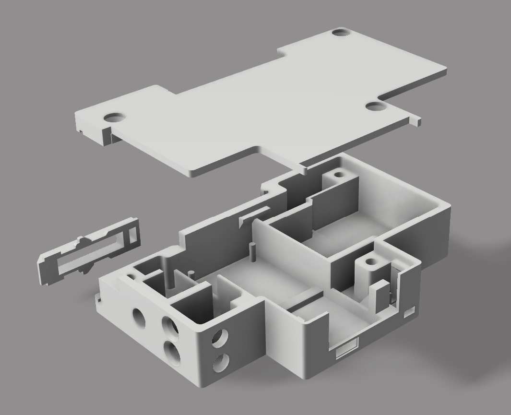

# ESPEnergyLogger
ESPEnergyLogger is a nicely executed failed attempt of realizing an electricity meter with logging capability.

The project includes the creation of a module which can be mounted on a standard DIN rail and connected directly to the power line.
Purpose of this module is to read at regular intervals the value of instantaneous current and voltage, and keep track of the energy consumption.
The logger interfaces with a python Flask server that stores these readings in a database and also provides a web interface.

Logger module
-------------

The core of the logger is the Espressif ESP32, a low cost SoC microcontroller plenty of features.
Its versatility and ease of use make it the perfect choice for this kind of DIY delusional projects.
The module itself is a chimera and an electrical engineer nightmare, it composed of:
  * ESP32 as cpu
  * ADS1115 16 bit ADC module
  * SSD1306 128x32px OLED display
  * A generic small power consumer device switching power supply (5VDC)
  * Electrical terminals
  * 3.5mm jack socket
  * Voltage divider handmade pcb
  * Function button
  * A little recklessness
    
The module also includes an external ferrite core for current sensing (SCT-013-030) connected with a standard 3.5mm jack

Realization
-----------
The module casing has been designed in Fusion 360 and then 3D printed

|  |  |
| ---------------------------- | ---------------------------- |
|  |  |

Internal circuitry has been assembled as follows

|  |  |
| ---------------------------- | ---------------------------- |

Final result

|  |  |
| ---------------------------- | ---------------------------- |
